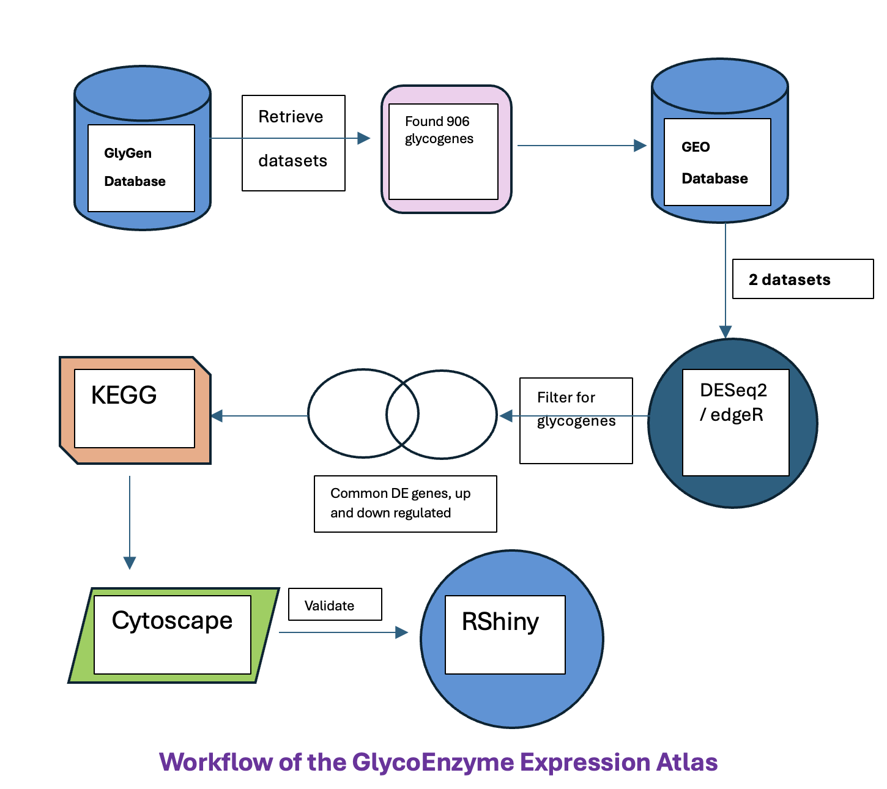

# GlycoEnzyme Expression Atlas: Linking Differential Expression to Pathway Dysregulation

Despite the critical role glycosylation plays in health and disease, the expression patterns of glycoenzymes and their impact on biological pathways remain poorly understood and underexplored. Existing resources do not effectively link differential glycoenzyme expression to pathway dysregulation across disease states, making it difficult for researchers to uncover disease mechanisms or identify therapeutic targets related to glycosylation.

## Why This Needs to Be Solved ?
 - Glycosylation is involved in key cellular processes, yet is often overlooked in genomic and pathway-level analyses.
 - Glycoenzymes are potential biomarkers and drug targets, but are not widely studied due to lack of integrated resources.
 - Current databases are fragmented, lacking a centralized, open-source platform that connects expression data to functional impact.
 - Solving this will empower researchers and clinicians to uncover glycosylation-related disease mechanisms, aiding precision medicine efforts.

## Objective
To build an open-source, interactive atlas that integrates transcriptomic data, glycoenzyme gene sets, and pathway/network analysis — enabling researchers to explore glycosylation-related dysregulation in diseases, starting with muscular dystrophy

## Workflow


## Methodology

The GlycoEnzyme Expression Atlas project was conducted in four key phases, each building toward identifying and visualizing glycoenzyme-driven pathway dysregulation in disease states.

### Phase 1: Disease Model Selection
- Identified 906 disease-associated glycosylation-related genes from databases like GlyGen. Data used:
- [GLY_000623 – Human Glycogenes](https://data.glygen.org/GLY_000623)
- [GLY_000004 – Human Glycosyltransferases](https://data.glygen.org/GLY_000004)
- [GLY_000025 – Human Glycoside Hydrolases](https://data.glygen.org/GLY_000025)

Through systematic analysis of glycogene-disease associations and glycosylation sites, we identified muscular dystrophy as the most promising disease model for RNA-seq analysis. This selection was based on:
- [GLY_000225 – Human Protein Glycosylation Diseases](https://data.glygen.org/GLY_000225)
- [GLY_000230 – Human Protein Glycosylation Disease Annotations](https://data.glygen.org/GLY_000230)
- [GLY_000308 – Human Glycogenes with Disease Associations](https://data.glygen.org/GLY_000308)

### Phase 2: RNA-Seq Differential Expression Analysis
**Disease-Glycosylation Association Analysis**
Selected two RNA-seq datasets related to muscular dystrophy from public repositories:
- [GSE140261 – RNA-seq data for Facioscapulohumeral Muscular Dystrophy (FSHD)](https://www.ncbi.nlm.nih.gov/geo/query/acc.cgi?acc=GSE140261)
- [PMCID: PMC8756543 – Molecular Features of FSHD through Transcriptomic Analysis](https://pmc.ncbi.nlm.nih.gov/articles/PMC8756543/)

1. **Data Collection and Preprocessing**
   - RNA-seq count matrix preparation
   - Quality control and normalization
   - Metadata organization and validation

2. **Differential Expression Analysis**
   - DESeq2/Edge R implementation for RNA-seq analysis
   - Statistical testing and multiple testing correction
   - Fold change and p-value calculations
   - These were filtered for glycoenzymes to focus on glycosylation-related dysregulation

### Phase 3: Pathway & Network Analysis
Validated the common genes using CFDE portal
Mapped filtered glycoenzymes to biological pathways using KEGG.
KEGG enrichment analysis using clusterProfiler to identify significantly enriched pathways involving glycoenzymes
Cytoscape to visualize and analyze the interaction networks of glycoenzymes, helping identify key hubs and functional modules involved in disease

### Phase 4: Interactive Visualization with R Shiny
To make our findings accessible and actionable, we developed an R Shiny application that allows researchers to:
- Input a gene of interest to explore its role in muscular dystrophy.
- View expression patterns and differential expression status.
- Visualize KEGG pathway associations and heatmaps across patients.
- Explore the gene’s network context via STRING-based interactions.
This tool bridges the gap between static analysis and interactive exploration, enabling users to dive deeper into glycosylation-related dysregulation in a user-friendly interface.

## Results

- Extracted **906 glycosylation-related genes** using curated datasets from GlyGen.
- Enrichment analysis of these genes revealed muscular dystrophy as a glycosylation-impacted disease.
- After RNA-seq analysis of two muscular dystrophy datasets: GSE140261 and GSE162108. We found: **152 common (between both datasets)upregulated genes** AND  **54 common (between both datasets) downregulated genes**
- Pathway Enrichment (KEGG) analysis revealed: **56 enriched pathways in one dataset AND 39 enriched pathways in the other**
- Cytoscape analysis revealed:
  Strong Glycoenzyme Involvement in GAG Metabolism
  Alteration in Chondroitin, Heparan, and Keratan Sulfate Pathways
  This suggests a widespread disruption in GAG metabolism, which is known to be critical for muscle structure, signaling, and regeneration.
  Alterations in these glycosylation-related pathways have been linked to muscle degeneration, inflammation, and impaired extracellular matrix remodeling — all hallmarks of muscular dystrophy.

Therefore, our findings strengthen the case that glycosylation, especially GAG-related pathways, plays a key role in muscular dystrophy pathogenesis.


## Conclusion

This project demonstrates a reusable pipeline to explore glycoenzyme expression and pathway dysregulation in disease. By integrating gene expression, pathway enrichment, and interaction networks:
We validated muscular dystrophy as a disease strongly linked to glycosylation dysfunction.
Identified core glycoenzymes and pathways that may serve as biomarkers or therapeutic targets.
Created a scalable framework that can be applied to other glycosylation-impacted diseases.
Developed an interactive R Shiny tool to make the results accessible to researchers, supporting gene-centric exploration and hypothesis generation.
This work highlights the importance of glycosylation in disease mechanisms and provides an open-source, FAIR-compliant approach to facilitate glyco-bioinformatics research.

## Scalability and Broader Impact
Our integrated approach not only identified differentially expressed glycoenzymes, but also clearly revealed key biochemical pathways—such as GAG biosynthesis and degradation—that are significantly disrupted in muscular dystrophy. This pipeline provides a framework for validating glycosylation pathway dysregulation in any disease. By simply plugging in disease-specific expression data, the workflow can be applied to:
- Identify glycoenzyme-related expression changes
- Perform pathway enrichment
- Map functional networks
- And ultimately highlight disease-relevant glycosylation mechanisms

This demonstrates that our tool is not limited to muscular dystrophy — it can be extended to any glycosylation-impacted condition, such as:
- Cancer
- Inflammatory bowel disease
- Congenital disorders of glycosylation
- Neurodegenerative diseases

This positions the GlycoEnzyme Expression Atlas as a versatile platform for exploring glycosylation biology in precision medicine and driving future therapeutic research.

## Prerequisites

- Python 3.x
- R version ≥ 4.0.0
- Bioconductor 3.12 or higher

## Installation

1. Clone this repository:
```bash
git clone https://github.com/yourusername/GlycoEnzyme-Atlas.git
cd GlycoEnzyme-Atlas
```

2. Install required dependencies:
```bash
pip install pandas numpy
```

## Getting Started

1. Ensure you have Python 3.x installed
2. Install required dependencies:
   ```bash
   pip install pandas numpy
   ```
3. Run analysis scripts from the project root directory
4. The Shiny app can be run using the following R code:
```R
shiny::runApp("app.R")
```
 
## Citation/References
## Acknowledgments
- CFDE/GlyGen for project support
- GlyCosmos and CAZy databases
- Bioconductor project and all package maintainers
- Broad Institute for computational resources
  
